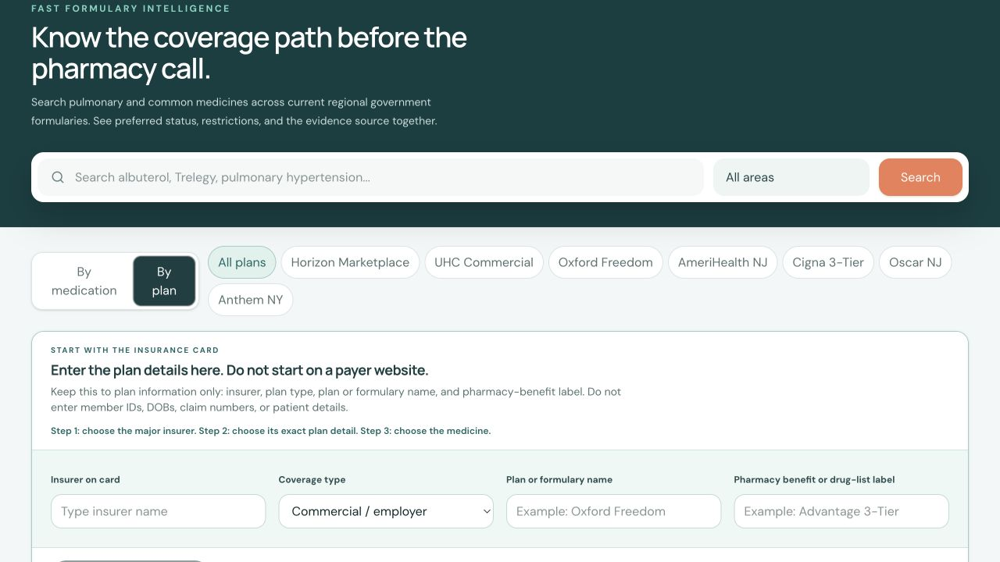
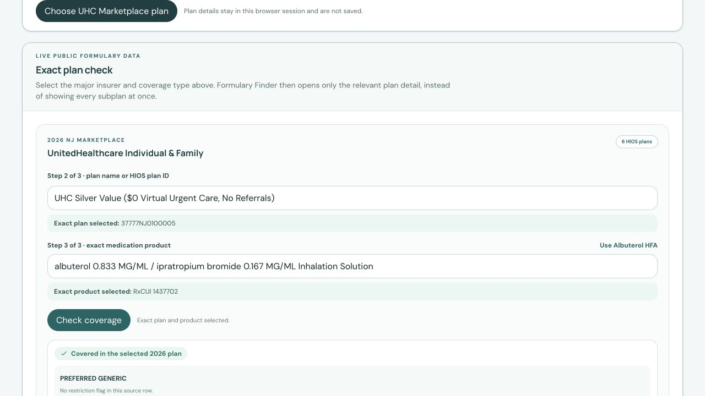

# Formulary Finder

Clinical formulary lookup for care teams. The application keeps the routine workflow in one portal: select the insurer, select the exact plan or drug-list detail, then select the medication product.

**Live application:** [formulary-finder-pilot-production.up.railway.app](https://formulary-finder-pilot-production.up.railway.app/)



## What clinicians can do

- Search 85 pulmonary and commonly used medication families by generic or brand name.
- Start from the insurance card without entering member IDs, dates of birth, claims, or other patient information.
- Use autocomplete for insurers, plan or formulary names, Medicare plans, and medication products.
- Select the exact Medicare Advantage or standalone Part D plan before reviewing CMS medication results.
- Check exact 2026 UnitedHealthcare New Jersey Marketplace coverage by HIOS plan and RxNorm product.
- Check Aetna Better Health of New Jersey FamilyCare coverage by exact 11-digit NDC.
- Check Wellpoint New Jersey FamilyCare PDL-listed medication products in the portal.
- Check Horizon BCBSNJ Marketplace and AmeriHealth NJ Individual & Family source-listed products in the portal.
- Check Horizon BCBSNJ Classic source-listed products when the pharmacy benefit explicitly says Classic.
- Check AmeriHealth New Jersey Value source-listed products when the pharmacy benefit explicitly says Value.
- Check AmeriHealth New Jersey Select source-listed products when the pharmacy benefit explicitly says Select.
- Check the named Oxford Freedom, UnitedHealthcare Commercial, and Cigna National Preferred baseline PDLs without leaving the portal.
- Review tier, prior authorization, step therapy, quantity-limit, and source information when supplied by the selected source.



## Clinical workflow

1. Select **By plan** and enter the major insurer and coverage type from the card.
2. Select the exact plan detail:
   - **Medicare Advantage:** choose the exact CMS Medicare Advantage plan.
   - **Standalone Part D:** choose the exact prescription-drug plan from the separate Part D card.
   - **UHC NJ Marketplace:** choose the HIOS plan.
   - **Aetna NJ FamilyCare:** select the exact medication NDC.
   - **Wellpoint NJ FamilyCare:** choose the NJ FamilyCare PDL, then select the medication product.
   - **Horizon Marketplace:** choose the Marketplace plan family, then the medication product.
   - **Horizon Classic:** choose **Horizon Classic** only when that pharmacy benefit is named on the card or benefits document, then choose the medication product. “Direct Access” alone is not enough.
   - **AmeriHealth Individual & Family:** choose the Individual & Family formulary family, then the medication product.
   - **AmeriHealth Value:** choose the Value formulary name from the plan card or benefits document, then search the medication in the filtered plan view.
   - **AmeriHealth Select:** choose the Select formulary name from the plan card or benefits document, then search the medication in the filtered plan view.
   - **Oxford Freedom, UHC Commercial, or Cigna National Preferred:** select the exact named baseline, then choose the medication product and confirm the employer benefit variant.
   - **Named reference formulary:** select the exact plan or formulary name, then continue to medication search.
3. Select the medication product and run **Check coverage** where an exact connector is available.
4. Read restrictions and source metadata before acting on the result.

The reference-plan browser is intentionally secondary. It supports plan identification and audit, while the primary clinical workflow remains insurer, exact plan, then medication.

## Result meanings

| Result | Meaning |
| --- | --- |
| **Covered** | The selected medication product appears in the selected source. Restrictions may still apply. |
| **Unconfirmed, not a denial** | The portal does not have a complete exact source match. It is not a coverage decision. |
| **Reference listing** | A static, dated formulary reference. Confirm the patient’s exact benefit before relying on it. |

Formulary evidence is not eligibility, a benefit guarantee, a payment determination, or prescribing advice. Always confirm the exact product, strength, dosage form, device, and restriction requirements.

## Current evidence coverage

### Exact, in-portal checks

| Coverage source | Exact selection required | Data returned |
| --- | --- | --- |
| CMS New Jersey Medicare Advantage | Contract, plan, segment, medication | Formulary rows, tier and restriction flags when matched |
| CMS New Jersey standalone Part D | Contract, plan, segment, medication | Formulary rows, tier and restriction flags when matched |
| UHC New Jersey Individual and Family Marketplace | 2026 HIOS plan and RxCUI | Tier and PA, ST, QL flags |
| Aetna Better Health of New Jersey FamilyCare | Exact 11-digit NDC | Tier and PA, ST, QL, OTC flags |

### Public source-backed plan-family checks

| Coverage source | Selection required | Result boundary |
| --- | --- | --- |
| Horizon BCBSNJ Marketplace | Marketplace coverage type and medication product | Source-listed result for the named Marketplace and three explicitly listed Direct Access small-group products; not generic Horizon employer/Direct Access, Medicaid, or Medicare |
| Horizon BCBSNJ Classic | Exact Horizon Classic pharmacy benefit and medication product | Quarterly Classic baseline; Direct Access alone does not identify this pharmacy formulary |
| AmeriHealth NJ Individual & Family | Individual & Family coverage type and medication product | Source-listed formulary-family result with tier/restriction flags when loaded; not Value, Select, employer, or Medicare |
| AmeriHealth NJ Value | Exact New Jersey Value formulary and medication product | Source-backed Value baseline; confirm the card or benefit document says Value |
| AmeriHealth NJ Select | Exact New Jersey Select formulary and medication product | Source-backed Select baseline; confirm the card or benefit document says Select |
| Oxford Freedom Network | Exact Oxford Freedom baseline and medication product | UHC-linked commercial PDL baseline; confirm the Oxford product and employer benefit |
| UnitedHealthcare Commercial | Exact UnitedHealthcare Commercial PDL baseline and medication product | General commercial PDL reference; employer benefit variants can differ |
| Cigna National Preferred 3-Tier | Exact named employer baseline and medication product | Abridged source-backed baseline; confirm the employer drug-list variant |
| Wellpoint New Jersey FamilyCare | NJ FamilyCare PDL and medication product | Source-listed product with PA, specialty-pharmacy, and quantity-limit flags where published; not Wellpoint commercial or Medicare |

These two public formulary guides are useful for a bounded clinic pilot, but they are not substitutes for an authenticated member-benefit lookup. The portal keeps the source family visible and returns **unconfirmed, not a denial** when a complete product mapping is unavailable.

### Source-backed reference formularies

The portal also includes dated, plan-specific or general-PDL references for selected regional plans. A general PDL is clearly labeled and must not be treated as an exact employer-benefit match. Accepted-insurer cards identify network participation and routing only, not medication coverage.

## Data design and safety

- The application is intentionally PHI-free and does not store patient identifiers.
- The clinic plan-list intake stays template-only. No files are uploaded, reviewed, or stored by the app.
- Insurer name alone never establishes medication coverage.
- Missing data is shown as unconfirmed, never as a denial.
- Exact connectors preserve the source date and use bounded, read-only retrieval and caching.
- External sources are retained for evidence and audit, not as the default clinical workflow.

## Product demo package

- [Clinician user guide](output/Formulary_Finder_Clinician_User_Guide.pdf)
- [Demo package and script](docs/DEMO_PACKAGE.md)
- [Plan/source matrix](docs/PLAN_SOURCE_MATRIX.md)
- [Sellable product brief](docs/SELLABLE_PRODUCT_BRIEF.md)
- [Market pricing and packaging](docs/MARKET_PRICING_AND_PACKAGING.md)
- [Specialty expansion plan](docs/SPECIALTY_EXPANSION_PLAN.md)
- [PHI-free clinic plan-list template](public/clinic-plan-intake-template.csv)

Recommended demo sequence: start with **By plan**, use a Horizon Marketplace or AmeriHealth Individual & Family example, choose a medication with autocomplete, press **Check formulary**, then show the source date and restriction flags. Finish with an exact UHC or Medicare plan lookup to demonstrate the stronger product-level connectors.

## Local development

```bash
npm install
npm run build
npm start
```

Open `http://localhost:3000`.

## Verification commands

```bash
npm test
npm run cms:test
npm run uhc:qhp:test
npm run aetna:familycare:test
npm run formulary:gaps:test
npm run build
```

## CMS data refresh

The CMS importer uses the official Monthly Prescription Drug Plan Formulary and Pharmacy Network Information archive. It needs the extracted plan-information and basic-drugs-formulary files.

```bash
DATABASE_URL='postgresql://...' \
CMS_PLAN_FILE='/absolute/path/plan information.txt' \
CMS_DRUG_FILE='/absolute/path/basic drugs formulary file.txt' \
CMS_STATES='NJ' \
CMS_PDP_REGION_CODES='04' \
CMS_SOURCE_URL='https://data.cms.gov/provider-summary-by-type-of-service/medicare-part-d-prescribers/monthly-prescription-drug-plan-formulary-and-pharmacy-network-information' \
CMS_SOURCE_VERSION='YYYY-MM-DD' \
npm run cms:import
```

Validate the current import without modifying data:

```bash
DATABASE_URL='postgresql://...' CMS_CHECK_STATE='NJ' npm run cms:check
```

## API surface

- `GET /api/health`
- `GET /api/medications?q=trelegy&plan=nyrx`
- `GET /api/medicare/plans?state=NJ&benefitType=ma&q=Humana`
- `GET /api/medicare/plans?state=NJ&benefitType=pdp&q=Wellcare`
- `GET /api/medicare/coverage?contractId=S4802&planId=078&segmentId=000&medication=albuterol`
- `GET /api/uhc-nj-qhp/plans?q=37777NJ0100002`
- `GET /api/uhc-nj-qhp/drugs?q=albu&limit=20`
- `GET /api/uhc-nj-qhp/coverage?planId=37777NJ0100002&rxcui=435`
- `GET /api/aetna-nj-familycare/metadata`
- `GET /api/aetna-nj-familycare/drugs?q=albuterol&limit=20`
- `GET /api/aetna-nj-familycare/coverage?ndc=00054074287`
